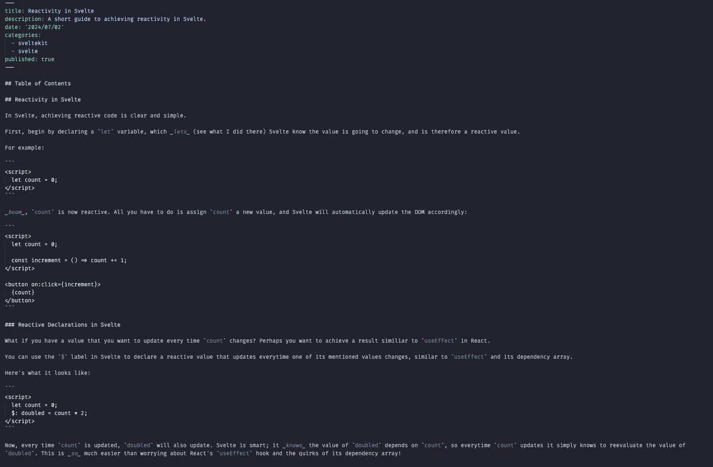
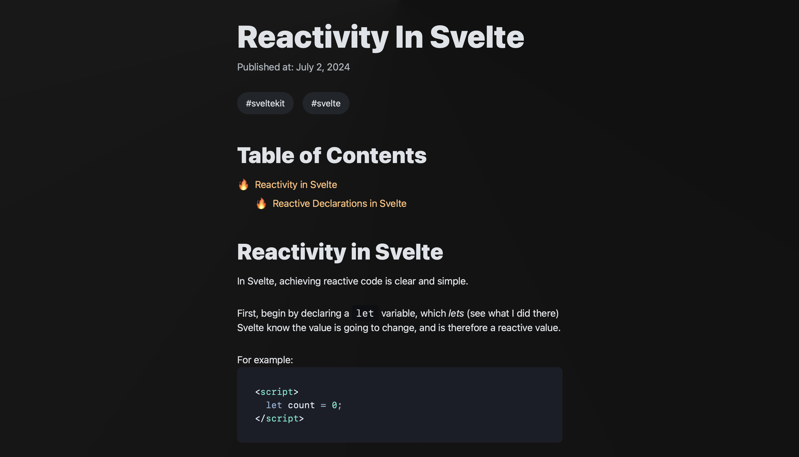
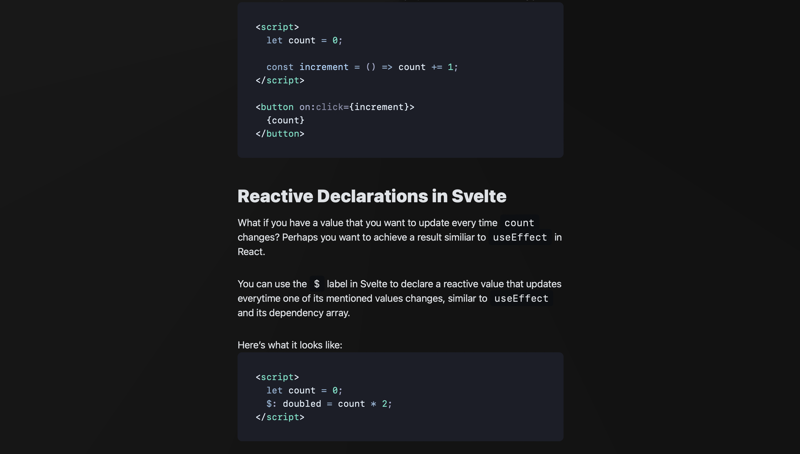

## Markdown Blog

Markdown files rendered as Svelte components with automatic Table of Content generation, syntax highlighting, and more

## Takes this...



## ...And turns it into this!




## Here is the code responsible for this magic:

### _routes/api/posts/+server.ts_

```
async function getPosts() {
	let posts: Post[] = [];

	const paths = import.meta.glob('/src/posts/*.md', {
		eager: true
	});

	for (const path in paths) {
		const file = paths[path];
		const slug = path.split('/').at(-1)?.replace('.md', '');

		if (file && typeof file === 'object' && 'metadata' in file && slug) {
			const metadata = file.metadata as Omit<Post, 'slug'>;
			const post = { ...metadata, slug } satisfies Post;
			if (post.published) posts.push(post);
		}
	}

	posts = posts.sort(
		(first, second) => new Date(second.date).getTime() - new Date(first.date).getTime()
	);

	return posts;
}

export const GET = async () => {
	const posts = await getPosts();

	return json(posts);
};
```

### _routes/[slug]/+page.ts_

```
export const load: Load = async ({ params }) => {
	try {
		const post = await import(`../../posts/${params.slug}.md`);

		return {
			content: post.default,
			meta: post.metadata
		};
	} catch (e) {
		console.log(e);
		throw error(404, `Could not find ${params.slug}`);
	}
};
```

### And finally, the component that renders it out: _routes/[slug]/+page.svelte_

```
<script lang="ts">
	import { formatDate } from '$lib/utils.js';

	export let data;
</script>

<svelte:head>
	<title>{data.meta.title}</title>
	<meta property="og:type" content="article" />
	<meta property="og:title" content={data.meta.title} />
</svelte:head>

<article>
	<hgroup>
		<h1>{data.meta.title}</h1>
		<p>Published at: {formatDate(data.meta.date)}</p>
	</hgroup>

	<div class="tags">
		{#each data.meta.categories as category}
			<span class="surface-4">
				&num;{category}
			</span>
		{/each}
	</div>

	<div class="prose">
		<svelte:component this={data.content} />
	</div>
</article>
```

---

## Live Preview: [View Project]('link')
